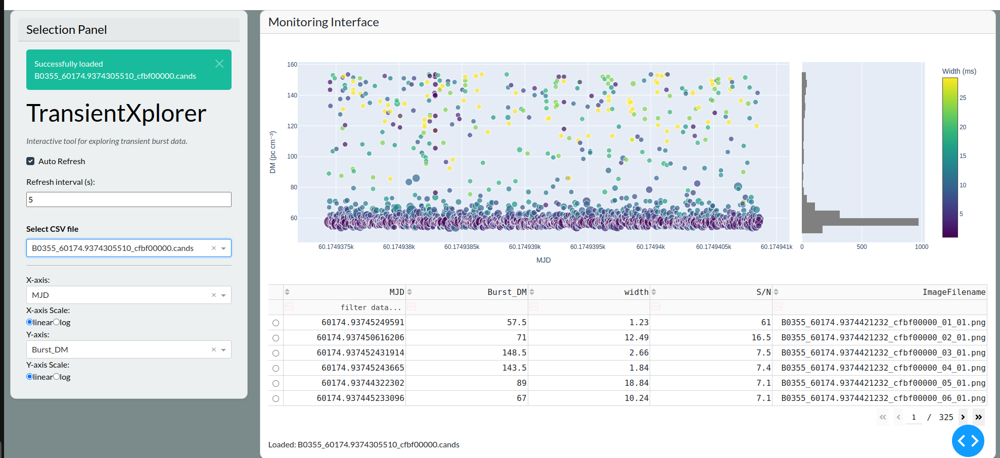
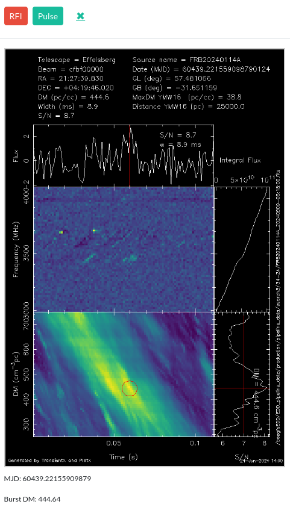

# TransientXplorer

**TransientXplorer** is a lightweight and interactive Dash-based web application for visualizing and inspecting transient candidates. Designed with time-domain astrophysics in mind, it allows researchers to efficiently explore candidate events using associated image data and metadata.

The application is built for analyzing radio burst candidates produced by TransientX (see [Men and Barr 2024](https://arxiv.org/abs/2401.13834)).


---

##  Features

- Interactive visualization of burst candidates  
- Filter and explore events by temporal widths, arrival times, or other parameters  
- Responsive web UI powered by Plotly Dash  
- Dockerized for easy deployment and portability  

---


### 1. Clone this repository

```bash
git clone https://gitlab.mpcdf.mpg.de/pral/TransientXplorer.git
cd TransientXplorer
```
##  Run with Singularity (No Docker or root access needed)

You can run the app using a pre-built Singularity image.


### Download the latest `.sif` from Zenodo:


[transientXplorer.sif](https://zenodo.org/records/15974012/files/transientxplorer.sif?download=1)  

DOI: [10.5281/zenodo.15974011](https://doi.org/10.5281/zenodo.15974011)

To Download it from the terminal:
```
wget -O transientxplorer.sif "https://zenodo.org/records/15974012/files/transientxplorer.sif?download=1"
```


###  Example Usage
The repository has a ```/candidates``` folder where you can find example csv file and image data. To visualise this data, run:

```bash
singularity exec --bind ./candidates:/data transientxplorer.sif python3 TransientXplorer.py 
```
This will by default run the application on ```localhost:8050```. If you want to specify a user defined port, run:

```bash
singularity exec --bind ./candidates:/data transientxplorer.sif python3 TransientXplorer.py --port <port number>
```
For personal use, one only needs to change the path ```./candidates``` to the user defined path. Note that the csv file and image data should be located in the same path.


## Web Interface Overview


##  Panel Breakdown

###  Left Panel (Controls)

- **Select CSV file**: Choose a `.cands` file from the dropdown list (Note: The application only accepts .csv or .cands files)
- **X/Y Axis**: Select which variables to display on the X and Y axes (e.g., `MJD`, `Burst_DM`, etc.)
- **Scale**: Toggle between `linear` and `log` scale for each axis
- **Auto Refresh**: Enable to refresh the data view automatically every N seconds

###  Right Panel (Visualization)

- **Scatter Plot**: (Default)
    - **X-axis**: MJD
    - **Y-axis**: Dispersion Measure (pc cm⁻³)
    - **Color**: Width (ms)
    - **Size**: S/N (Signal-to-Noise Ratio)
- Click any point to open the associated candidate image
- **Histogram**: Shows the distribution of the Y-axis quantity

- **Tabular Data**:
    - Shows the burst properties mentioned above and the TransientX PNG files
    
    - User can click on any tabular cell to open the associated candidate image

### Additional features:
- The margin between graph and table can be dragged to resize the layout according to your needs.
- The scatter plot can be filtered by applying filters on different burst properties
    - For example: Only visualize high S/N ratio candidates using a (> 30) filter in the S/N column


## ML Classification:
After opening the associated candidate image, the pop-up will look like this:


On the top left corner of the image, you will find an option to label the candidate as 'rfi' or 'pulse'. Once you label all the candidates using manual inspection, a new .cands file will be written with an extra column for the ML Label (0: rfi and 1: pulse) respectively.

## Citation:
If you use TransientXplorer in your work, please cite the Zenodo DOI:
```
@misc{transientxplorer_zenodo,
  author       = {Pranav Limaye},
  title        = {TransientXplorer: A lightweight Dash app for transient candidate exploration},
  year         = {2025},
  publisher    = {Zenodo},
  doi          = {10.5281/zenodo.15974011},
  url          = {https://doi.org/10.5281/zenodo.15974011}
}
```

## Troubleshooting:
By default, the app runs on ```port 8050``` which might be already in use on certain servers. 

To check which ports are already in use on your device, run:
```
netstat -tuln
```
Then, select a free port accordingly using the port flag.


##  Contact

For questions, bugs, or feature requests, open an issue or contact:  
limaye@mpifr-bonn.mpg.de


